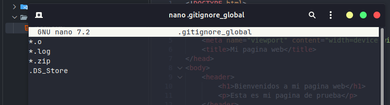
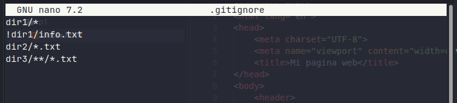
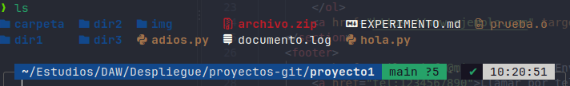
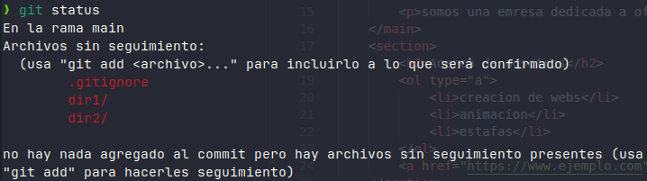

# Práctica 2

## 1. gitignore_global

Primero añado mi archivo global en mi carpeta de usuario personal.
Aqui muestro los parametros que pide la pracica esto se aplicara a todos mis proyectos

Tambien creo los archivos `prueba.o`, `documento.log`, `archivo.zip` y `carpeta/.DS_Store`

## 2. gitignore

Añado el archivo `.gitignore` local para este proyecto. 

Y tambien aado sus parametros

`!dir1/info.txt` crea una excepción para ser reconocido

## 3. Comprobación

Antes de comprobar el status pongo un ls para que se muestre que esta todo creado

al ejecutar git status confirmamos que Git igora.

## 4. Git status

dir1/: Aparece como archivo sin seguimiento porque ! salvo al archivo info.txt los demas fueron ignorados.
dir2/: Aparece porque contiene un archivo otros.py que es válido y los archivos .txt fueron ignorados.
dir3/: No aparece en el status porque todos sus archivos eran .txt.

## 5. Diferencias entre ignorar de forma local y global

Ignorado Global: Se aplica a nivel de usuario en el ordenador.
Ignorado Local: Se aplica únicamente al repositorio donde se encuentra.
